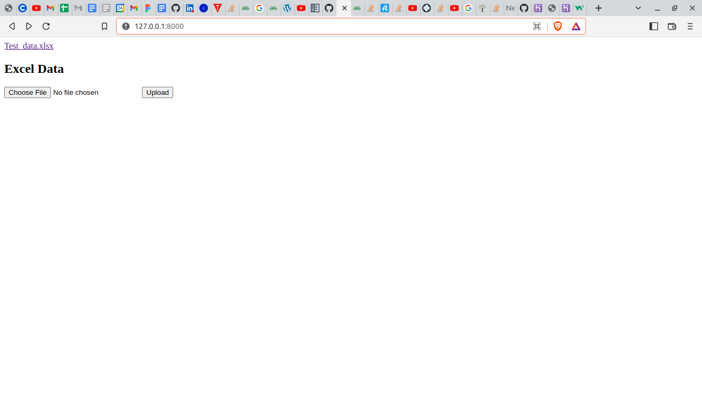
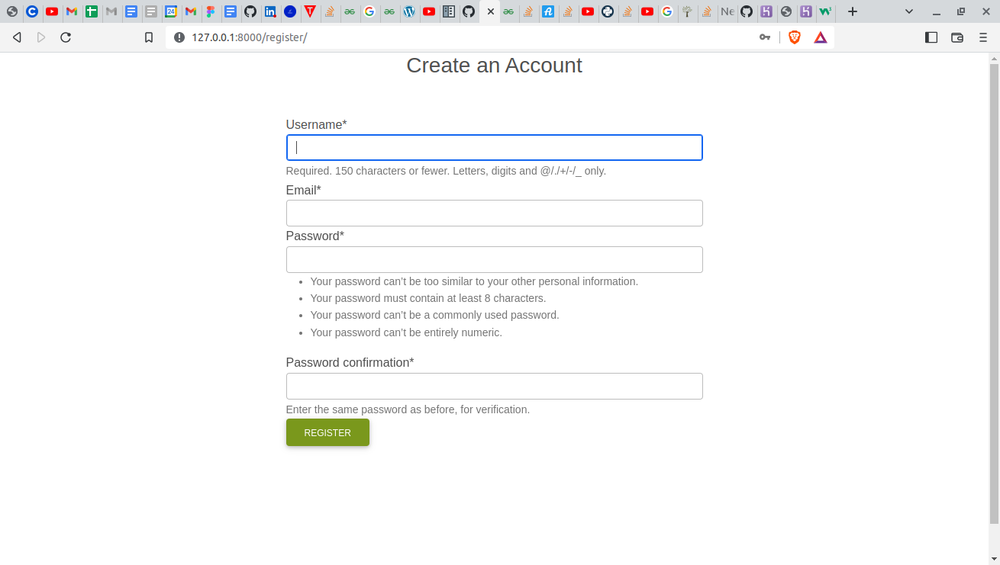
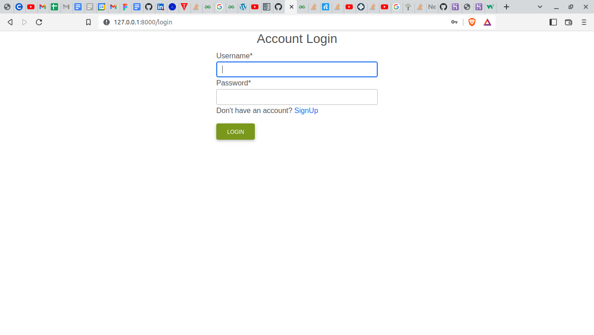
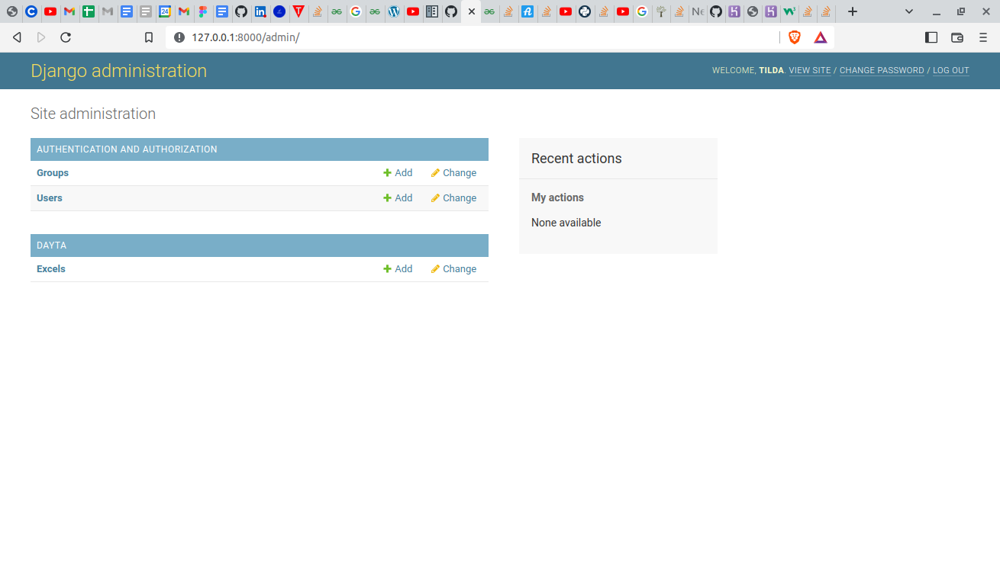
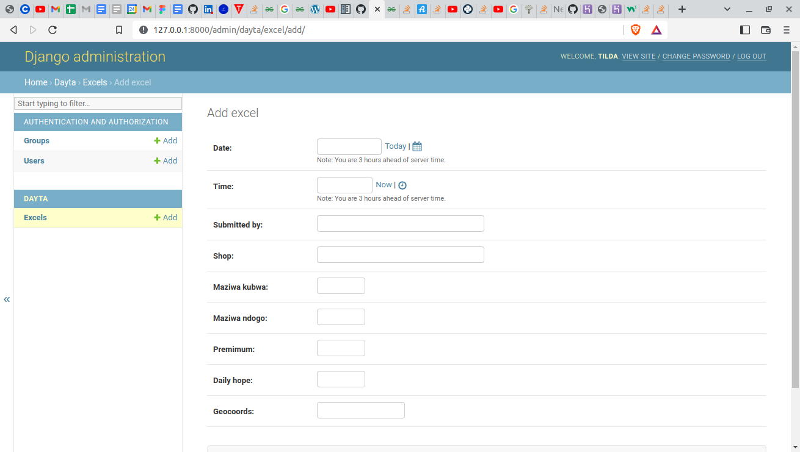

# Hokela-Dayta Application

#### Created By Maltilda Nyaboke

<br>

<br>

<br>

<br>


### Description

Hokela-Dayta is terminal-based application that enables a user to create a new account with their credentials, via signing up. One is also able to login into the application and gives the admin the authority to import data from the computer and store it in the database. 
## Setup Requirements

- Git
- Web-browser of your choice
- Github
- Django 
- Pip
- Python 3.10
- PostgreSQL

## Setup Installation

- Copy the github repository url
- Clone to your computer
- Open terminal and navigate to the directory of the project you just cloned to your computer
- Run the following command to start the server using virtual environment

```
python3.9 -m venv --without-pip virtual
```

- To activate the virtual environment

```
source virtual/bin/activate
```

```
curl https://bootstrap.pypa.io/get-pip.py | python
```

```
pip install -r requirements.txt
```

- To copy .env.example to .env

```
cp .env.example .env
```

- Edit the .env file and replace the values with your own database credentials

- To run the server

```
python manage.py runserver

```


- Open the browser and navigate to http://127.0.0.1:8000/ to see the application in action

## Admin Credentials
 - username - tilda
 - password - tilda

### Technologies Used

- The following languages have been used on this project:

- HTML
- CSS
- Bootstrap
- Python
- Django
- PostgreSQL

## Known Bugs
After uploading the xlsx file one is not able to view it due to the date format provided.

## Support and contact details

To make a contribution to the code used or any suggestions you can click on the contact link and email me your suggestions.

- Email: matildahnyaboke@gmail.com
